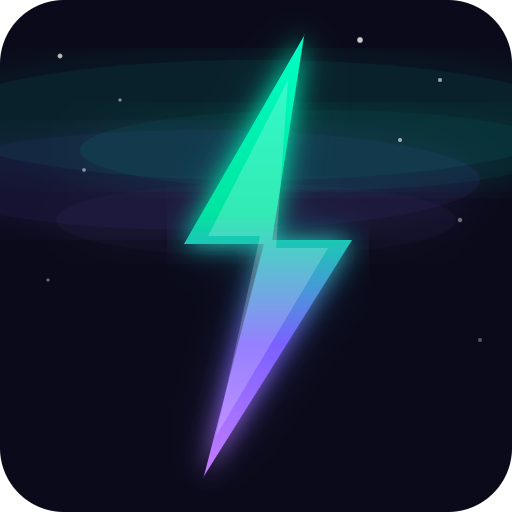

<p align="center">
  
</p>

# Norway Electricity Prices — Home Assistant Integration

[](https://github.com/Kvikku/ElectricityPriceAddon/actions/workflows/hacs-validate.yaml)
[](https://github.com/Kvikku/ElectricityPriceAddon/releases)
[](LICENSE)
[](https://www.home-assistant.io/)
[](https://hacs.xyz/)

A custom Home Assistant integration that fetches real-time Norwegian
electricity spot prices from
[hvakosterstrommen.no](https://www.hvakosterstrommen.no/) and provides
sensors, price level indicators, and smart automation helpers for each of the
five Norwegian price areas (NO1–NO5).

---


## Table of Contents

- [Features](#features)
- [Installation](#installation)
- [Configuration](#configuration)
- [Sensors & Entities](#sensors--entities)
- [Example Dashboard](#example-dashboard)
- [Lovelace Examples](#lovelace-examples)
- [Automation Examples](#automation-examples)
- [Data Source](#data-source)
- [Documentation](#documentation)
- [Contributing](#contributing)
- [Troubleshooting](#troubleshooting)
- [License](#license)

---

## Features

| Feature | Description |
|---------|-------------|
| ⚡ **Current hour price** | Real-time NOK/kWh with EUR price as attribute |
| ⏭️ **Next hour price** | Plan ahead with upcoming hour's price |
| 📊 **Daily statistics** | Average, min, and max prices with timestamps |
| 🏷️ **Price level** | Categorical indicator: `very_cheap` → `very_expensive` |
| 💚 **Cheapest hours** | Binary sensor ON during the N cheapest hours today |
| 🔴 **Expensive hours** | Binary sensor ON during the N most expensive hours |
| 🔋 **Best charging window** | Finds the cheapest consecutive block of N hours (ideal for EV charging) |
| 📅 **Tomorrow's prices** | Fetched automatically once available (~13:00 CET), with HA event fired |
| 🧾 **VAT toggle** | Include or exclude 25% MVA in integration options |
| 🗺️ **Multi-area** | Add the integration multiple times for different price areas |
| ✅ **HACS compatible** | Easy install and updates through HACS |

---

## Installation

### HACS (Recommended)

1. Open **HACS** in your Home Assistant instance.
2. Go to **Integrations** → **⋮ menu** → **Custom repositories**.
3. Add this repository URL:
   ```
   https://github.com/Kvikku/ElectricityPriceAddon
   ```
4. Select category **Integration** and click **Add**.
5. Find **Norway Electricity Prices** in the integration list and click
   **Install**.
6. **Restart** Home Assistant.

### Manual Installation

1. Download or clone this repository.
2. Copy the `custom_components/norway_electricity/` folder into your Home
   Assistant `config/custom_components/` directory.
3. **Restart** Home Assistant.

---

## Configuration

### Initial Setup

1. Go to **Settings** → **Devices & Services** → **Add Integration**.
2. Search for **Norway Electricity Prices**.
3. Select your price area:

   | Code | Region |
   |------|--------|
   | **NO1** | Oslo / Øst-Norge |
   | **NO2** | Kristiansand / Sør-Norge |
   | **NO3** | Trondheim / Midt-Norge |
   | **NO4** | Tromsø / Nord-Norge |
   | **NO5** | Bergen / Vest-Norge |

4. Done! Sensors will appear automatically.

> 💡 **Tip:** Add the integration multiple times to monitor different price
> areas simultaneously.

### Options

After adding the integration, click **Configure** to adjust:

| Option | Default | Range | Description |
|--------|---------|-------|-------------|
| Include VAT (25%) | ✅ On | — | Add 25% MVA to spot prices |
| Cheapest hours | 6 | 1–12 | Number of hours considered "cheap" |
| Most expensive hours | 6 | 1–12 | Number of hours considered "expensive" |
| Price threshold | 1.0 | 0–50 | NOK/kWh limit for threshold binary sensors |

---

## Sensors & Entities

Each price area creates **10 entities**. Replace `{area}` with the
**lowercase** area code: `no1`, `no2`, `no3`, `no4`, or `no5`.

| Entity | Type | State | Key Attributes |
|--------|------|-------|----------------|
| `sensor.electricity_price_no5` | Sensor | Current NOK/kWh | `price_eur`, `hour`, `raw_today`, `raw_tomorrow` |
| `sensor.next_hour_price_no5` | Sensor | Next hour NOK/kWh | `price_eur`, `hour` |
| `sensor.average_price_no5` | Sensor | Today's average | — |
| `sensor.min_price_no5` | Sensor | Today's lowest | `hour` of cheapest |
| `sensor.max_price_no5` | Sensor | Today's highest | `hour` of most expensive |
| `sensor.price_level_no5` | Sensor | Category string | — |
| `binary_sensor.cheapest_hours_no5` | Binary | ON if cheap now | `cheapest_hours`, `best_consecutive_window`, `best_consecutive_window_tomorrow` |
| `binary_sensor.expensive_hours_no5` | Binary | ON if expensive now | `expensive_hours` |
| `binary_sensor.price_below_threshold_no5` | Binary | ON if below threshold | `threshold`, `current_price` |
| `binary_sensor.price_above_threshold_no5` | Binary | ON if above threshold | `threshold`, `current_price` |

📖 **Full details:** [Sensor Reference](docs/sensors.md)

---

## Example Dashboards

Several ready-to-use dashboards are available in the [`examples/`](examples/) folder, ranging from simple to complex. All examples use **NO3** (Trondheim / Midt-Norge) — replace every `no3` with your area code (e.g. `no1`, `no5`).

| Dashboard | Complexity | HACS extras? | Description |
|-----------|:----------:|:------------:|-------------|
| [`dashboard-minimal.yaml`](examples/dashboard-minimal.yaml) | 🟢 Simple | None | Two glance cards — current price, next hour, level, and cheap/expensive status. Great for a sidebar panel. |
| [`dashboard-overview.yaml`](examples/dashboard-overview.yaml) | 🟡 Moderate | None | Full-page daily overview with gauge, daily stats, price comparison, and all sensors list. |
| [`dashboard.yaml`](examples/dashboard.yaml) | 🟠 Detailed | [apexcharts-card] | Comprehensive reference dashboard with charts, tables, and all features. |
| [`dashboard-ev-charging.yaml`](examples/dashboard-ev-charging.yaml) | 🔴 Advanced | [apexcharts-card] | Energy-optimisation dashboard for EV owners — charging window, cheapest/expensive tables, and 48 h forecast. |

[apexcharts-card]: https://github.com/RomRider/apexcharts-card

> 📖 **Full guide:** See [`examples/README.md`](examples/README.md) for installation instructions and customisation ideas.

---

## Lovelace Examples

### Colour-Coded Hourly Price Bar Chart

Requires [apexcharts-card](https://github.com/RomRider/apexcharts-card)
(install via HACS):

```yaml
type: custom:apexcharts-card
header:
  title: Electricity Prices Today
  show: true
graph_span: 24h
span:
  start: day
now:
  show: true
  label: Now
series:
  - entity: sensor.electricity_price_no5
    data_generator: |
      const data = entity.attributes.raw_today || [];
      return data.map(e => [new Date(e.start).getTime(), e.price]);
    type: column
    name: NOK/kWh
    color_threshold:
      - value: 0
        color: "#4CAF50"
      - value: 0.5
        color: "#8BC34A"
      - value: 1.0
        color: "#FFC107"
      - value: 2.0
        color: "#FF9800"
      - value: 3.0
        color: "#F44336"
```

### Today + Tomorrow (48h View)

```yaml
type: custom:apexcharts-card
header:
  title: Electricity Prices (48h)
  show: true
graph_span: 48h
span:
  start: day
now:
  show: true
  label: Now
series:
  - entity: sensor.electricity_price_no5
    data_generator: |
      const today = entity.attributes.raw_today || [];
      const tomorrow = entity.attributes.raw_tomorrow || [];
      if (tomorrow.length === 0) return [];
      const all = [...today, ...tomorrow];
      return all.map(e => [new Date(e.start).getTime(), e.price]);
    type: column
    name: NOK/kWh
    color_threshold:
      - value: 0
        color: "#42A5F5"
      - value: 0.5
        color: "#66BB6A"
      - value: 1.0
        color: "#FFA726"
      - value: 2.0
        color: "#FF7043"
      - value: 3.0
        color: "#EF5350"
```

### Current vs Average Price

```yaml
type: markdown
title: Current vs Average
content: |
  
  
  
  
  🔴 **{{ diff | round(2) }}** above avg
  
  🟢 **{{ (diff | abs) | round(2) }}** below avg
  
  🟡 At average
  
  (avg: {{ avg | round(2) }} NOK/kWh)
```

📖 **More examples:** [Automation & Lovelace Examples](docs/automations.md)

---

## Automation Examples

### Notify When Cheap Electricity Starts

```yaml
automation:
  - alias: "Notify cheap electricity"
    trigger:
      - platform: state
        entity_id: binary_sensor.cheapest_hours_no5
        to: "on"
    action:
      - service: notify.mobile_app_your_phone
        data:
          title: "⚡ Cheap electricity now!"
          message: >
            Current price: {{ states('sensor.electricity_price_no5') }} NOK/kWh.
            Good time to charge the car or run the dishwasher!
```

### Pause EV Charging During Expensive Hours

```yaml
automation:
  - alias: "Pause EV charging — expensive hours"
    trigger:
      - platform: state
        entity_id: binary_sensor.expensive_hours_no5
        to: "on"
    action:
      - service: switch.turn_off
        entity_id: switch.ev_charger
  - alias: "Resume EV charging — cheap hours"
    trigger:
      - platform: state
        entity_id: binary_sensor.expensive_hours_no5
        to: "off"
    action:
      - service: switch.turn_on
        entity_id: switch.ev_charger
```

📖 **More automations:** [Automation Examples](docs/automations.md) — includes
dishwasher scheduling, water heater control, daily summaries, template
sensors, and more.

---

## Data Source

All data comes from
[hvakosterstrommen.no](https://www.hvakosterstrommen.no/) — a free, open API
provided by [Hva koster strømmen](https://www.hvakosterstrommen.no/).

- **No API key required**
- **Update interval:** every 30 minutes
- **Tomorrow's prices:** typically available after 13:00 CET

---

## Documentation

| Document | Description |
|----------|-------------|
| [Sensor Reference](docs/sensors.md) | Detailed info on every entity, attribute, and event |
| [Automation Examples](docs/automations.md) | Ready-to-use automations, Lovelace cards, and template sensors |
| [Architecture](docs/architecture.md) | Internal data flow, components, and design decisions |
| [Development Guide](docs/development.md) | Setup, testing, and code style for contributors |
| [Contributing](CONTRIBUTING.md) | How to report bugs, suggest features, and submit PRs |

---

## Contributing

Contributions are welcome! Please see [CONTRIBUTING.md](CONTRIBUTING.md) for
guidelines.

```bash
# Quick start for developers
git clone https://github.com/Kvikku/ElectricityPriceAddon.git
cd ElectricityPriceAddon
python -m venv .venv && source .venv/bin/activate
pip install pytest aiohttp ruff
pytest tests/ -v
```

---

## Troubleshooting

| Problem | Solution |
|---------|----------|
| No data after setup | Check HA logs (Settings → System → Logs). The API may be temporarily unavailable. |
| Prices show 0.0 | Verify your price area is correct. Check if the API has data for today. |
| Tomorrow's prices missing | Normal before ~13:00 CET. They appear automatically when the API publishes them. |
| Sensors show "unavailable" | Restart HA. If persistent, remove and re-add the integration. |
| HACS can't find the integration | Ensure you added the repository URL as a custom repository with category "Integration". |

---

## License

[MIT](LICENSE)
