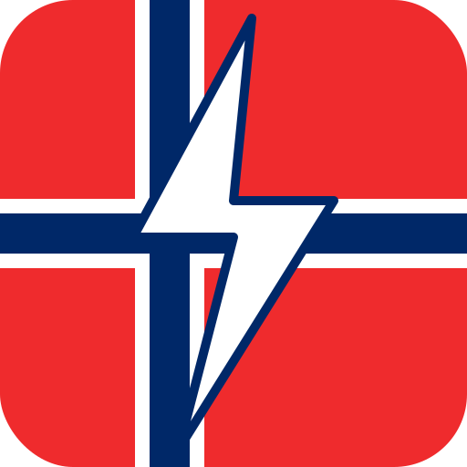

# Norway Electricity Prices — Home Assistant Integration

<p align="center">
  
</p>

A custom Home Assistant integration that fetches real-time Norwegian electricity spot prices from [hvakosterstrommen.no](https://www.hvakosterstrommen.no/) and provides sensors, price level indicators, and smart automation helpers for each of the five price areas (NO1–NO5).

## Features

- **Current hour price** (NOK/kWh) — with EUR price as attribute
- **Next hour price** — plan ahead
- **Today average / min / max** — daily statistics with timestamps
- **Price level** — categorical indicator: `very_cheap`, `cheap`, `normal`, `expensive`, `very_expensive`
- **Cheapest hours binary sensor** — ON when the current hour is among the N cheapest today
- **Most expensive hours binary sensor** — ON when the current hour is among the N most expensive
- **Best consecutive window** — attribute showing the cheapest consecutive block of N hours (great for EV charging)
- **Tomorrow's prices** — fetched automatically once available (~13:00 CET), with HA event fired
- **VAT toggle** — include or exclude 25% MVA in options
- **Multi-area support** — add the integration multiple times for different price areas
- **HACS compatible**

## Installation

### HACS (Recommended)

1. Open HACS in your Home Assistant instance
2. Go to **Integrations** → **⋮ menu** → **Custom repositories**
3. Add this repository URL and select category **Integration**
4. Click **Install**
5. Restart Home Assistant

### Manual

1. Copy the `custom_components/norway_electricity/` folder to your Home Assistant `config/custom_components/` directory
2. Restart Home Assistant

## Configuration

1. Go to **Settings** → **Devices & Services** → **Add Integration**
2. Search for **Norway Electricity Prices**
3. Select your price area:
   - **NO1** — Oslo / Øst-Norge
   - **NO2** — Kristiansand / Sør-Norge
   - **NO3** — Trondheim / Midt-Norge
   - **NO4** — Tromsø / Nord-Norge
   - **NO5** — Bergen / Vest-Norge
4. Done! Sensors will appear automatically.

### Options

After adding the integration, click **Configure** to adjust:

| Option | Default | Description |
|--------|---------|-------------|
| Include VAT (25%) | ✅ On | Add 25% MVA to spot prices |
| Cheapest hours | 6 | Number of hours considered "cheap" |
| Most expensive hours | 6 | Number of hours considered "expensive" |

## Sensors Created

| Entity | Type | State | Key Attributes |
|--------|------|-------|----------------|
| `sensor.electricity_price_*` | Sensor | Current NOK/kWh | `price_eur`, `hour`, `raw_today`, `raw_tomorrow` |
| `sensor.next_hour_price_*` | Sensor | Next hour NOK/kWh | `price_eur`, `hour` |
| `sensor.average_price_*` | Sensor | Today's average | — |
| `sensor.min_price_*` | Sensor | Today's lowest | `hour` of cheapest |
| `sensor.max_price_*` | Sensor | Today's highest | `hour` of most expensive |
| `sensor.price_level_*` | Sensor | Category string | — |
| `binary_sensor.cheapest_hours_*` | Binary | ON if cheap now | `cheapest_hours`, `best_consecutive_window` |
| `binary_sensor.expensive_hours_*` | Binary | ON if expensive now | `expensive_hours` |

## Lovelace Card Examples

### Hourly Price Bar Chart (ApexCharts)

Install [apexcharts-card](https://github.com/RomRider/apexcharts-card) via HACS, then add this card:

```yaml
type: custom:apexcharts-card
header:
  title: Electricity Prices Today
  show: true
graph_span: 24h
span:
  start: day
series:
  - entity: sensor.electricity_price_no5
    data_generator: |
      const data = entity.attributes.raw_today || [];
      return data.map(e => [new Date(e.start).getTime(), e.price]);
    type: column
    name: NOK/kWh
    color: "#4CAF50"
```

### Price Chart — Today + Tomorrow

```yaml
type: custom:apexcharts-card
header:
  title: Electricity Prices
  show: true
graph_span: 48h
span:
  start: day
series:
  - entity: sensor.electricity_price_no5
    data_generator: |
      const today = entity.attributes.raw_today || [];
      const tomorrow = entity.attributes.raw_tomorrow || [];
      const all = [...today, ...tomorrow];
      return all.map(e => [new Date(e.start).getTime(), e.price]);
    type: column
    name: NOK/kWh
    color: "#2196F3"
```

## Automation Examples

### Notify When Cheapest Window Starts

```yaml
automation:
  - alias: "Notify cheap electricity"
    trigger:
      - platform: state
        entity_id: binary_sensor.cheapest_hours_no5
        to: "on"
    action:
      - service: notify.mobile_app_your_phone
        data:
          title: "⚡ Cheap electricity now!"
          message: >
            Current price: {{ states('sensor.electricity_price_no5') }} NOK/kWh.
            Good time to charge the car or run the dishwasher!
```

### Notify When Tomorrow's Prices Are Available

```yaml
automation:
  - alias: "Tomorrow prices available"
    trigger:
      - platform: event
        event_type: norway_electricity_tomorrow_available
    action:
      - service: notify.mobile_app_your_phone
        data:
          title: "Tomorrow's electricity prices"
          message: >
            Prices for tomorrow are now available.
            Cheapest window:
            {{ state_attr('binary_sensor.cheapest_hours_no5', 'best_consecutive_window') }}
```

### Pause EV Charging During Expensive Hours

```yaml
automation:
  - alias: "Pause EV charging — expensive hours"
    trigger:
      - platform: state
        entity_id: binary_sensor.expensive_hours_no5
        to: "on"
    action:
      - service: switch.turn_off
        entity_id: switch.ev_charger
  - alias: "Resume EV charging — cheap hours"
    trigger:
      - platform: state
        entity_id: binary_sensor.expensive_hours_no5
        to: "off"
    action:
      - service: switch.turn_on
        entity_id: switch.ev_charger
```

## Data Source

All data comes from [hvakosterstrommen.no](https://www.hvakosterstrommen.no/) — a free, open API requiring no API key.

## License

MIT
