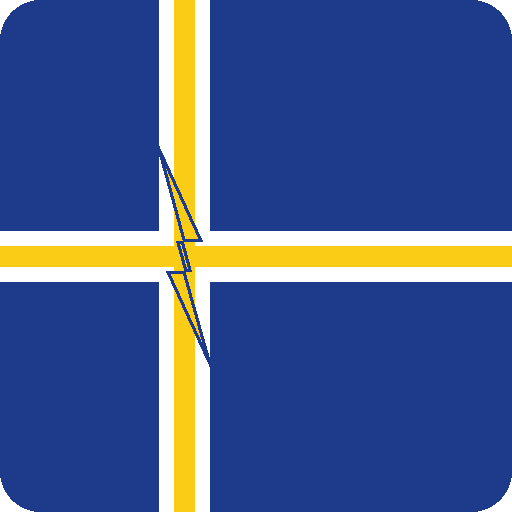
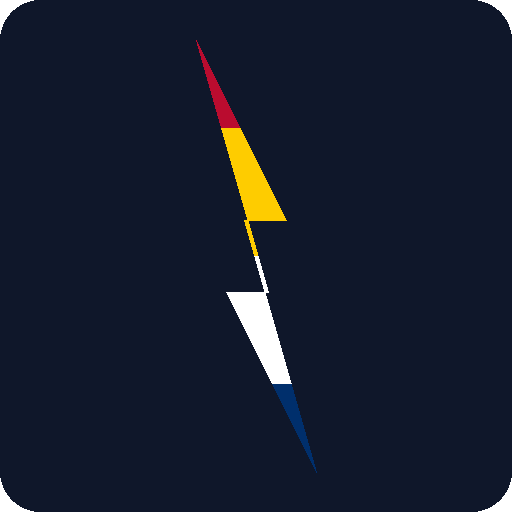
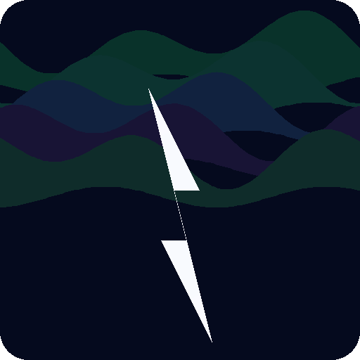
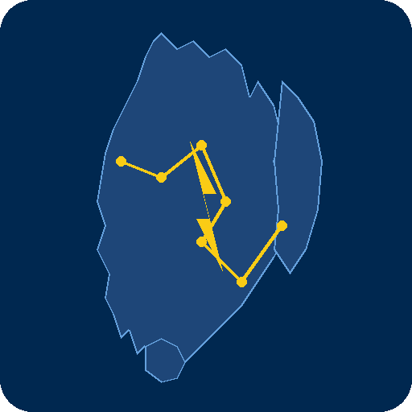
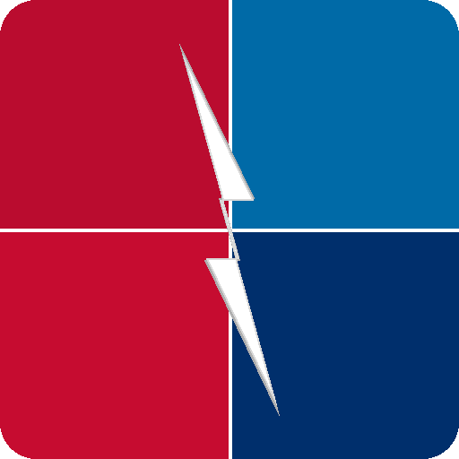
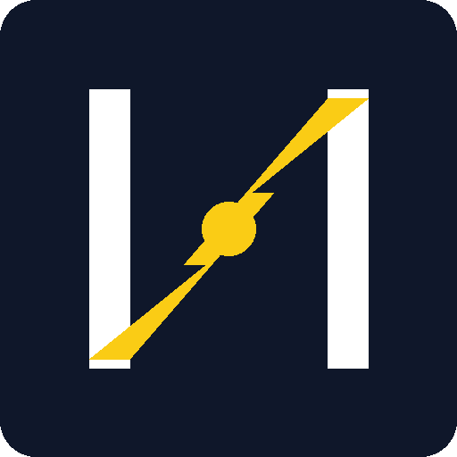

# Logo Concepts — Pick Your Favorite!

Below are 6 logo concepts for the Nordic Electricity Prices integration. Let me know which one(s) you like and I'll generate the full brand asset set (icon 256×256, icon@2x 512×512, logo, logo@2x).

---

## Concept 1 — Nordic Cross + Lightning Bolt
Deep blue background with a white + gold Nordic cross; gold lightning bolt at the intersection.

---

## Concept 2 — Four-Color Lightning Bolt
Dark slate background with a large lightning bolt split into 4 horizontal color bands (Norway red → Sweden yellow → Denmark white → Finland blue).

---

## Concept 3 — Northern Lights + Power Symbol
Dark night-sky background with wavy green/blue/purple aurora bands at the top and a bright white lightning bolt below.

---

## Concept 4 — Nordic Map Silhouette + Circuit
Teal-blue background with a stylized outline of the Scandinavian peninsula, Finland, and Denmark, connected by gold circuit dots and a central gold bolt.

---

## Concept 5 — Quadrant Shield
Four colored quadrants (Norway red, Sweden blue, Denmark red, Finland blue) divided by white lines, with a large white lightning bolt across the center.

---

## Concept 6 — Minimalist "N⚡" Mark
Dark slate background with a white letter "N" whose diagonal stroke is replaced by a gold lightning zigzag.

